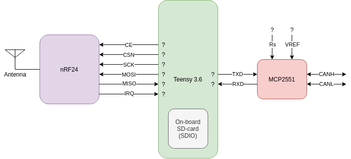

[back to README](../README.md)

# The Solar Car Unit 

## Table of Contents

- [The Solar Car Unit](#the-solar-car-unit)
  - [Table of Contents](#table-of-contents)
  - [Specification](#specification)
    - [Interface](#interface)
    - [Features](#features)
  - [Implementation](#implementation)
    - [Schematic](#schematic)
    - [Modules](#modules)
      - [Teensy 3.6](#teensy-36)
      - [nRF24](#nrf24)
      - [MCP2551](#mcp2551)
    - [Software Architecture](#software-architecture)

---
[back to top](#top)
## Specification

### Interface

The following table gives an overview of the interface of the solar car module with its surroundings.

|Port Name|Direction|Description|
|:-|:-:|:-|
|CAN Hi|Bidirectional|The high wire of the differential CAN bus|
|CAN Lo|Bidirectional|The low wire of the differential CAN bus|
|RF|Bidirectional|Wireless communication channel to the support vehicle|
|SD|Bidirectional|Interface to a SD-card as a permanent storage solution for the logging data|

### Features

The following table gives an exhaustive list of all the features of the solar car module in a categorized way.

|Feature ID|Description|
|:-|:-|
|**SC.SD**          |The system uses a SD card as a permanent storage of log files
|SC.SD.write        |Write a data structure to a file on the SD card
|SC.SD.read         |Read a file into a data structure
||
|**SC.RF**          |The system needs to communicate via a RF module with the support vehicle
|SC.RF.rxCmd        |Receive a system configuration command from the support vehicle
|SC.RF.rxCanCmd     |Receive a message to be broadcasted via the solar car CAN bus
|SC.RF.txResp       |Transmit response to a received command
|SC.RF.txLogUnit    |Transmit a log unit to the support vehicle
|SC.RF.txLogFile    |Transmit a log file to the support vehicle
||
|**SC.CAN**         |The system needs to communicate via the solar car CAN bus
|SC.CAN.rx          |Receive all messages broadcasted on the CAN bus
|SC.CAN.tx          |Transmit a message on the CAN bus
||
|**SC.BUF**         |The system needs to buffer logged data in local flash memory until enough data to fill a file is collected
|SC.BUF.add         |Add a log unit to the buffer
|SC.BUF.rd          |Read a logging unit from the buffer into RAM
|SC.BUF.rdToFile    |Read all logged data from the buffer into a file
|SC.BUF.clr         |Empty the buffer

---
[back to top](#top)
##  Implementation

### Schematic

### Modules

#### Teensy 3.6

As a controller of the SCU a [Teensy 3.6](https://www.pjrc.com/store/teensy36.html) is used. The following table shows the pin usage:

|Name|Pin Number|Direction|Description|
|:-|:-:|:-:|:-|
|CE     |?  |output |Chip enable signal for the RF module
|CSN    |?  |output |Chip select signal for the RF module (active low)
|SCK    |?  |output |Serial clock of the SPI connection to the RF module
|MOSI   |?  |output |Serial data output of the SPI connection to the RF module
|MISO   |?  |input  |Serial data input of the SPI connection to the RF module
|IRQ    |?  |input  |Interrupt request line from the RF module
|TXD    |?  |output |Serial data output to the CAN transceiver
|RXD    |?  |input  |Serial data input fom the CAN transceiver

#### nRF24

#### MCP2551

### Software Architecture