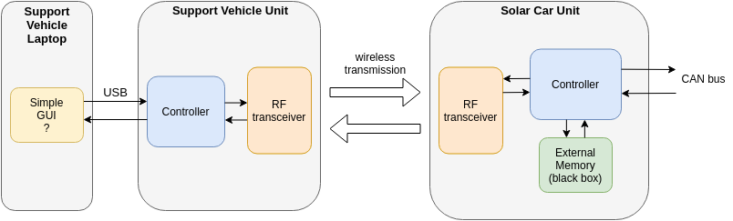

[Back to README](../README.md)

# Implementation possibilities

---

# Solar Car unit
<table>
<tr><th>Main Controller </th><th> CAN Bus Controller</th><th>External Memory</th></tr>
<tr><td style='vertical-align:top'>

[**Teensy**](components.md#teensy):
- pros:
    - access to Arduino software stack
- cons:
---
[**Patmos**](components.md#patmos):
- pros:
- cons:
---

</td><td style='vertical-align:top'>

**Use the available CAN bus controller (SPI?)**
- pros:
- cons:

---

**Design own CAN bus controller on FPGA**
- pros:
- cons:
    - Would require custom circuitry in front of FPGA
---

</td><td style='vertical-align:top'>

[**SPI SDCard**](components.md#externalmemory)
- pros:
    - SPI interface will most likely be needed anyways for RF module
- cons:
---

</td></tr> </table>

---

# Support Vehicle unit
<table>
<tr><th>Controller </th><th> UART Controller </th></tr>
<tr><td style='vertical-align:top'>

**Arduino**
- pros:
- cons:

---

[**Teensy**](components.md#teensy)
- pros:
- cons:
    - more performance than required (power is no concern in the support vehicle though)
---

</td><td style='vertical-align:top'>

**Integrated in uC**
- pros:
- cons:

---

</td></tr> </table>

---

# Support Vehicle Laptop

<table>
<tr><th>Interface </th></tr>
<tr><td>

1. Mini GUI to send and receive
2. More advanced GUI with a small monitoring dashboard
2. Just send data via UART
3. Command line interface

</td></tr> </table>

---

# Wireless Transmission
<table>
<tr><th>RF Transceiver Modules </th></tr>
<tr><td>

[**CC1101**](components.md#CC1101)
- pros:
- cons:
---
[**nRF24**](components.md#nrf24)
- pros:
- cons:
---
[**nRF905**](components.md#nrf905)
- pros:
- cons:
---
[**SX1278 (LoRa)**](components.md#sx1278)
- pros:
    - long range and low power
- cons:
---
[**HC12**](components.md#hc12)
- pros:
- cons:
---

</td></tr> </table>