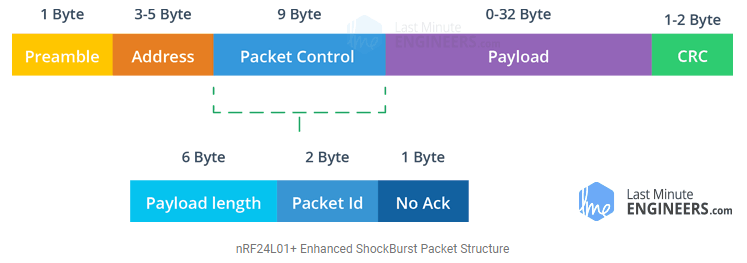
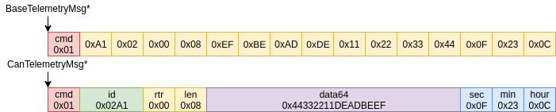

[back to README](../README.md)

# Message Protocols

This document specifies the protocols used for passing data in the telemetry system.

## Table of Contents
- [Message Protocols](#message-protocols)
  - [Table of Contents](#table-of-contents)
  - [- The Message Protocol](#--the-message-protocol)
  - [Introduction](#introduction)
  - [nRF24L01+ Transmission Protocol](#nrf24l01-transmission-protocol)
  - [The Message Protocol](#the-message-protocol)
---

[back to top](#top)
## Introduction

The telemetry system relies on message passing via the RF channel from one system to the other. These messages can be of different types and can carry different payloads. Therefore a flexible system for passing information between the devices is needed.

Since this system revolves around the capabilities of the radio communication system, the transmission protocol for the nRF24L01+ modules is considered first.

## nRF24L01+ Transmission Protocol

The nRF24L01+ transceiver module uses a packet structure known as Enhanced ShockBurst. This simple packet structure is broken down into 5 different fields, which is illustrated below. 

In short, the nRF24L01+ uses an acknowledge flag with an interrupt to indicate whether a message was succesully transmitted and received. 

[Read full article](https://lastminuteengineers.com/nrf24l01-arduino-wireless-communication/)

## The Message Protocol

